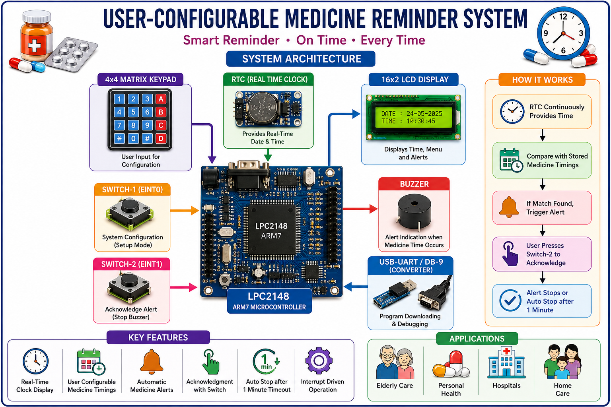

# 💊 User-Configurable Medicine Reminder System using LPC2148 ARM7

<p align="center">


</p>

---

# ⭐ Overview

A smart **User-Configurable Medicine Reminder System** developed using the **LPC2148 ARM7 Microcontroller** to help users take medicines at the correct scheduled time.

Unlike conventional fixed alarm systems, this project allows the user to **configure medicine timings dynamically using a 4x4 Matrix Keypad**.

The system continuously monitors the **Real-Time Clock (RTC)** and compares the current time with stored medicine schedules.

When the scheduled medicine time occurs, the system:

- 💊 Displays **"Take Medicine Now"**
- 🔔 Activates the Buzzer
- ⏱ Starts an Acknowledgment Timer
- 🔘 Waits for User Confirmation
- 🔄 Automatically returns to RTC Monitoring

---

# 🎯 Project Objectives

- Display Real-Time Clock on LCD
- Allow User-Configurable Medicine Timings
- Monitor Medicine Schedules in Real Time
- Generate Automatic Medicine Alerts
- Provide Buzzer-Based Reminder
- Support User Acknowledgment
- Automatically Stop Alert After Timeout
- Allow RTC Date and Time Modification
- Implement External Interrupt-Based Control
- Provide Continuous Medicine Schedule Monitoring

---

# 📷 Complete System Architecture

<p align="center">



</p>
---

# 🧩 Hardware Components

| Component | Purpose |
|------------|---------|
| LPC2148 ARM7 | Main System Controller |
| RTC | Real-Time Date and Time Monitoring |
| 16x2 LCD | Display Time and Alert Messages |
| 4x4 Matrix Keypad | Medicine Time Configuration |
| Buzzer | Medicine Alert Generation |
| Switch-1 | System Configuration Interrupt |
| Switch-2 | Medicine Acknowledgment Interrupt |
| USB-UART / DB-9 | Programming and Communication |

---

# 🖥 System Block Diagram

<p align="center">


</p>

---

# ⚙️ System Working Flow

<p align="center">


</p>

---

# 🔧 System Configuration Mode

The **System Configuration Mode** is activated using **Switch-1**.

Switch-1 is connected to the **EINT0 External Interrupt** of LPC2148.

Once Switch-1 is pressed, the controller displays configuration options on the LCD.

The user can select:

- 🕒 Edit RTC Time
- 💊 Configure Medicine Schedule

The required option is selected using the **4x4 Matrix Keypad**.

---

# 🛠 Configuration Flow

<p align="center">


</p>

---

## 🕒 RTC Time Configuration

The RTC configuration feature allows the user to modify the current system date and time.

<p align="center">


</p>

### RTC Configuration Process

```text
Press Switch-1
        │
        ▼
EINT0 Interrupt Triggered
        │
        ▼
Display Configuration Menu
        │
        ▼
Select Edit RTC
        │
        ▼
Enter Date and Time
        │
        ▼
Update RTC
        │
        ▼
Return to Normal Mode
```

---

## 💊 Medicine Schedule Configuration

The user can configure one or more medicine timings using the **Matrix Keypad**.

<p align="center">


</p>

### Medicine Configuration Process

```text
Press Switch-1
        │
        ▼
Enter Setup Mode
        │
        ▼
Select Medicine Configure
        │
        ▼
Enter Medicine Timing
        │
        ▼
Store Schedule in Memory
        │
        ▼
Return to RTC Monitoring
```

---

# 🕒 Clock-Only Mode

If no medicine schedule is configured, the system operates as a **Digital Clock**.

In this mode:

- RTC Date is displayed
- RTC Time is displayed
- Medicine Schedule Checking is Disabled
- Buzzer remains OFF

<p align="center">


</p>

---

# 🔍 Real-Time Medicine Monitoring

Once at least one medicine schedule is configured, the LPC2148 continuously reads the RTC.

The controller performs:

```text
Read RTC Time
      │
      ▼
Read Stored Medicine Timings
      │
      ▼
Compare Current Time
      │
      ▼
Medicine Time Match?
      │
   ┌──┴──┐
   │     │
  NO    YES
   │     │
   │     ▼
   │   Trigger Alert
   │
   ▼
Continue Monitoring
```

---

# 🔔 Medicine Alert System

When the RTC time matches a stored medicine schedule:

- LCD displays **"Take Medicine Now"**
- Buzzer starts periodic **ON/OFF Alert**
- Acknowledgment Timer starts
- System waits for User Confirmation

<p align="center">


</p>

---

# 🔘 User Acknowledgment using EINT1

The user confirms medicine intake using **Switch-2**.

Switch-2 is connected to the **EINT1 External Interrupt**.

### Acknowledgment Flow

```text
Medicine Alert Triggered
        │
        ▼
LCD: "Take Medicine Now"
        │
        ▼
Buzzer ON / OFF Alert
        │
        ▼
Start 1-Minute Timer
        │
        ▼
Switch-2 Pressed?
       / \
     YES  NO
      │    │
      ▼    ▼
Stop     Wait Until
Buzzer   Timeout
      │    │
      ▼    ▼
Clear    Auto Stop
Alert    Buzzer
      │    │
      └─┬──┘
        ▼
Return to RTC Monitoring
```

---

# ⏱ Alert Timeout Mechanism

The system implements a **1-Minute Acknowledgment Timer**.

If the user presses **Switch-2 within one minute**:

- Buzzer stops immediately
- Reminder is cleared
- System returns to RTC monitoring

If the user does **not acknowledge within one minute**:

- Buzzer automatically stops
- Reminder message is cleared
- System continues normal execution

---

# 🔄 Complete Software Flow

<p align="center">


</p>

```text
System Start
     │
     ▼
Initialize LPC2148 Peripherals
     │
     ├── Initialize RTC
     ├── Initialize LCD
     ├── Initialize Keypad
     ├── Initialize Buzzer
     ├── Initialize Timer
     ├── Enable EINT0
     └── Enable EINT1
     │
     ▼
Read RTC Date & Time
     │
     ▼
Display Time on LCD
     │
     ▼
Medicine Schedule Available?
       / \
     NO   YES
      │     │
      ▼     ▼
Clock    Compare RTC Time
Mode     with Medicine Time
      │     │
      │     ▼
      │   Time Match?
      │     / \
      │   NO   YES
      │    │     │
      │    │     ▼
      │    │   Display Alert
      │    │     │
      │    │     ▼
      │    │   Start Buzzer
      │    │     │
      │    │     ▼
      │    │   Start Timer
      │    │     │
      │    │     ▼
      │    │   Check EINT1
      │    │     │
      │    │     ▼
      │    │   Stop Alert
      │    │
      └────┴───────────────┐
                           │
                           ▼
                  Continue Monitoring
```

---

# ⚡ External Interrupt Architecture

| Interrupt | Switch | Function |
|------------|---------|----------|
| EINT0 | Switch-1 | Enter System Configuration |
| EINT1 | Switch-2 | Medicine Acknowledgment |

The interrupt-driven architecture improves system responsiveness and allows the controller to immediately react to user requests.

---

# 💾 Memory Usage

| Memory | Usage |
|----------|---------|
| RAM | User Input and Runtime Variables |
| Flash | Embedded C Program |
| Controller Memory | Medicine Schedule Storage |
| RTC Registers | Date and Time Information |

---

# 🔧 Communication & Interface

| Device | Interface |
|----------|------------|
| RTC | I2C |
| LCD | GPIO |
| Matrix Keypad | GPIO |
| Buzzer | GPIO |
| Switch-1 | EINT0 |
| Switch-2 | EINT1 |

---

# 🧠 System Operating Modes

The Medicine Reminder System operates in three major modes:

| Mode | Operation |
|------|-----------|
| Configuration Mode | Edit RTC and Medicine Schedule |
| Clock Mode | Display RTC Date and Time |
| Reminder Mode | Alert User at Medicine Time |

---

# 🚀 Features

- User-Configurable Medicine Timings
- Real-Time Clock Monitoring
- Automatic Medicine Reminder
- LCD Alert Display
- Periodic Buzzer Alert
- Medicine Intake Acknowledgment
- One-Minute Alert Timeout
- External Interrupt-Based Control
- Dynamic Medicine Schedule Configuration
- Digital Clock Mode
- Continuous Real-Time Monitoring
- Embedded C Firmware
- ARM7-Based Embedded System

---

# 📸 Project Gallery

<p align="center">

 |  | 

</p>

---

# 💻 Software Used

- Embedded C
- Keil μVision
- Flash Magic

---

# 🔌 Hardware Used

- LPC2148 ARM7 Microcontroller
- Real-Time Clock (RTC)
- 16x2 LCD
- 4x4 Matrix Keypad
- Buzzer
- Push Button Switches
- USB-UART Converter / DB-9 Cable

---

# 🌍 Applications

- Home Medicine Reminder Systems
- Elderly Patient Medication Assistance
- Personal Healthcare Devices
- Hospital Patient Reminder Systems
- Embedded Healthcare Applications
- Daily Tablet Reminder Systems

---

# 🔮 Future Enhancements

- GSM-Based SMS Medicine Alerts
- IoT-Based Remote Monitoring
- Mobile Application Integration
- Wi-Fi Connectivity
- Cloud-Based Medicine History
- Multiple User Support
- Medicine Name Display
- Voice-Based Reminder
- Missed Medicine Tracking

---

# 👩‍💻 Author

**Palakurla Shirisha Goud**

Bachelor of Technology (Information Technology)

Embedded Systems Engineer

2025 Graduate

---

# 📜 License

This project is intended for **educational and academic purposes**.

Feel free to fork, modify, and improve the project.

---

# 🙏 Thank You

Thank you for visiting this project.

⭐ **If you find this project useful, consider giving the repository a star!**
